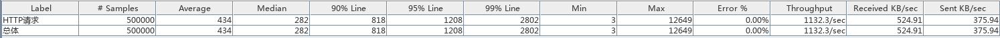
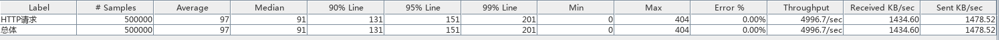
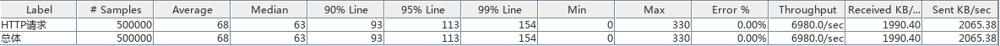

# Alipay-Wechat-Platform

## 命名
原来命名是Wechat-Alipay-Platform，但这样缩写WAP、可能引起歧义，所以改成Alipay-Wechat-Platform，缩写AWP（还是有歧义，但至少不是一个领域的）。
## 意义
本项目旨在减少Web项目关于微信、支付宝的重复代码，以及解决公众号的安全域名只能配置一个的问题。  
未来还可以托管Access Token。
本项目部署后，将公众号安全域名配置到本项目的域名，此后多个web项目（不同域名）可以使用同一个公众号 ~~（理论上）~~ 。  
## 技术栈
### 变迁
原来：`Vue.js + Spring Boot + Druid + MySQL`  
现在：`Vue.js + Vert.X(Core+Web+JDBC) + HikariCP + MySQL(可能换成PostgreSQL)`  
### Benchmark
针对支付配置获取的API进行测试。  
- 测试工具：`Jemeter3.2 r1790748`
- 测试环境：`Manjaro 17.0.5 x86_64 Linux 4.9.53-1-MANJARO`,`OpenJDK 1.8.0_144`
- 硬件配置：Intel Core i7-6560U @ 4x 3.2GHz, 8G DDR3, 256G SSD  

`Spring`(无Shiro过滤)测试结果：  
  
`Vert.X`(JWT授权+MariaDB)测试结果：  
  
`Vert.X`(JWT授权+PostgreSQL)测试结果：  
  

## Maven子模块
- `awp-base`: PoJo类，工具类（通用工具、微信工具、支付宝工具）
- `awp-final`: 最终打成Vert.X整合包，包括后台管理和服务的入口
- `awp-verticle-bms`: 后台管理页面，需要JWT授权登录
- `awp-verticle-base`: Verticle基础通用类，包括一个基础接口机器抽象类，以及定义EventBus常量的命名空间
- `awp-verticle-db`: 数据库相关类
- `awp-verticle-message`: 微信、支付宝(模板/客服/图文)消息发送服务(TODO)
- `awp-verticle-oauth`: 微信、支付宝(TODO)授权服务
- `awp-verticle-pay`: 微信、支付宝支付服务(TODO)

## 启动方式
### 增加支付宝Maven依赖
进入项目目录，执行以下命令：
```bash
mvn install:install-file -Dfile=dependencies/com.alipay.api-1.0.jar -DgroupId=com.alipay -DartifactId=api -Dversion=1.0 -Dpackaging=jar
mvn install:install-file -Dfile=dependencies/com.antgroup.zmxy.openplatform-1.0.jar -DgroupId=com.antgroup -DartifactId=zmxy.openplatform -Dversion=1.0 -Dpackaging=jar
```
### 配置文件
可以放在任何位置，任何文件名，内容参考`awp-final/src/main/resources/config.json`。  

### 命令行启动
```bash
mvn clean package
java -jar awp-final/target/awp-0.0.1-SNAPSHOT-fat.jar [/path/to/配置文件]
```
注: `awp-final`编译时会调用Docker的Remote API(2375端口)进行push等操作，在MacOS下的Docker Desktop没有开启，可以通过以下命令开启:
```bash
brew install socat
socat -d TCP-LISTEN:2375,range=127.0.0.1/32,reuseaddr,fork UNIX:/var/run/docker.sock
```

### 调试
从`awp-final`子模块中的`com.turingdi.awp.MainLauncher`类启动项目即可，启动参数参考命令行启动的命令（从`run`开始）。

## 后台管理页面
入口地址：`http://localhost:8083/`

## API
### 微信授权
申请微信授权。web服务需要授权时，向用户发送重定向到该接口。
- 请求地址：`http://localhost:8083/oauth/wx/apply/{body}`  
- 参数：body，格式为变种Base64编码的JSON，请用http://localhost:8083/static/page/sys/base64.html 进行编码

例如（请修改域名后，在微信打开，静默授权，授权后跳到百度首页(为了展示可以回调到任何地址)，观察地址，rs参数是图灵Base64加密后的结果）: http://localhost:8083/oauth/wx/apply/bgNVIODVIfwpZOI2dADsO3DVIOD3TmLgZSI2KOgxIODVIOkBHCjsHfqB1YI2IfhMTmD2oY60T0cuHfqpZm8uHt6nIVp6OV~~
```json
{
    "eid":1, /*web项目使用的公众号在本项目中的用户ID*/
    "type":0,/*0=静默授权，只能获取OpenID，1=正常授权，会弹出授权确认页面，可以获取到用户信息*/
    "callback":"http://dict.baidu.com"/*授权成功后调用的web项目回调接口地址,请使用完整地址,回调时会使用GET方法，加上rs参数，rs参数值是turingBase64加密的授权结果(JSON)*/
}
```

### 支付宝授权
申请支付宝授权。web服务需要授权时，向用户发送重定向到该接口。
- 请求地址：`http://localhost:8083/oauth/zfb/apply/{body}`  
- 参数：body，格式为变种Base64编码的JSON，请用http://localhost:8083/static/page/sys/base64.html 进行编码

例如（请修改域名后打开，静默授权，授权后跳到百度首页(为了展示可以回调到任何地址)，观察地址，rs参数是图灵Base64加密后的结果）: http://localhost:8083/oauth/wx/apply/bgNVIODVIfwpZOI2dADsO3DVIOD3TmLgZSI2KOgxIODVIOkBHCjsHfqB1YI2IfhMTmD2oY60T0cuHfqpZm8uHt6nIVp6OV~~
```json
{
    "eid":1, /*web项目使用的公众号在本项目中的用户ID*/
    "type":0,/*0=静默授权，只能获取OpenID，1=正常授权，会弹出授权确认页面，可以获取到用户信息*/
    "callback":"http://dict.baidu.com"/*授权成功后调用的web项目回调接口地址,请使用完整地址,回调时会使用GET方法，加上rs参数，rs参数值是turingBase64加密的授权结果(JSON)*/
}
```

### 微信公众号的AccessToken与JsTicket
#### AccessToken
- 请求方法：POST  
- 来源限制：与awp同网段的访问（通过请求头的`X-Forwarded-For`与`X-Real-IP`请求头判断，通过nginx反代访问的都会带上）  
- 接口地址：`http://localhost:8083/tk/wx/act/{eid}`  
- 请求参数：eid路径参数，用户ID  

#### JsTicket
- 请求方法：POST  
- 来源限制：与awp同网段的访问（通过请求头的`X-Forwarded-For`与`X-Real-IP`请求头判断，通过nginx反代访问的都会带上）  
- 接口地址：`http://localhost:8083/tk/wx/jst/{eid}`  
- 请求参数：eid路径参数，用户ID  

### 微信支付
微信支付相对比较麻烦，单次支付涉及到多个接口。  
具体的应用可以参考`awp-verticle-admin/resources/static/page/paytest.html`页面的例子。  
P.S. 支付的页面需要引入`https://res.wx.qq.com/open/js/jweixin-1.2.0.js`。  
#### 预处理(wx.config用)
- 请求方法：GET，由页面AJAX调用  
- 来源限制：暂无  
- 接口地址：`http://localhost:8083/pay/wx/pre/{eid}/{url}`  
- 请求参数：eid:路径参数，用户ID; url:当前页面URL，请将完整URL进行URL编码再发送  
- 响应格式：JSON
- 响应内容：appId，timestamp（生成签名的时间戳），noncestr（生成签名的随机串），signture（签名），由`wx.config()`使用。  

#### 下单
- 请求方法：POST，由页面AJAX调用  
- 来源限制：暂无  
- 接口地址：`http://localhost:8083/pay/wx/order`  
- 请求参数：JSON格式的字符串，包括以下参数：eid(企业用户ID),orderId(本地订单ID),openId(用户OpenID),price(价格，单位：分),name(产品名),callback(支付成功后回调接口，请填写完整URL，无需编码)  
- 响应格式：JSON
- 响应内容：appId,timestamp（生成签名的时间戳），noncestr（生成签名的随机串）,packages(prepay_id),paysign(签名)。供`WeixinJSBridge.invoke('getBrandWCPayRequest',{})`使用  

#### 退款
(TODO)

### 支付宝支付
#### 下单
需要使用支付宝支付时，由由用户调用此接口（可以是web服务返回重定向到本接口，或后台计算出接口地址，让js跳转）。  
- 请求地址：`http://localhost:8083/pay/zfb/order/{body}`  
- 参数：body，格式为变种Base64编码的JSON，请用http://localhost:8083/static/sys/page/base64.html 进行编码。  

例如(如: http://localhost:8083/pay/zfb/order/bYkL1CX3PB7sIf6YZGwYSCX3P3IjKBKjKBKMdEH0POIsIWJY1CdLIBNjoOkuHCyLIBN32Iu55p2cI3g3HtqsvGkhHts3P3kNTmigP3Q-ZGLBTO53HCL9TS5BvtM3oOkzTCdBZedzIBN31miMcAN-otj-Htqs1G6zTAN4KAVzo0dMHeipHY6gHCTLo0d5cY63HedLdBXu1minvOk6  
```json
{
    "eid":1,/*web项目使用的公众号在本项目中的用户ID*/
    "orderId":"1231234567",/*本地订单ID，请保持唯一性*/
    "price":1,/*价格，单位：分*/
    "name":"苹果",/*产品名称*/
    "callback":"http://dict.baidu.com",/*支付成功后异步回调地址，将会带上支付宝回调的所有参数*/
    "success":"http://localhost:8083/static/page/sys/base64.html"/*支付后前段立即跳转的地址*/
}
```
#### 退款
(TODO)

### (客服/模板)消息发送
#### 微信客服消息
- 请求方法：PUT  
- 来源限制：与awp同网段的访问（通过请求头的`X-Forwarded-For`与`X-Real-IP`请求头判断，通过nginx反代访问的都会带上）  
- 接口地址：`http://localhost:8083/msg/wx/kf`  
- 请求参数：JSON格式，无需编码，详见`请求提示例`  
- 响应格式：JSON
- 响应内容：微信公众号模板消息接口返回的消息

请求体示例：
```json
{
    "eid": 2,/*web项目使用的公众号在本项目中的用户ID*/
    "openId": "of2333333333333333333333OBuk",/*用户OpenID*/
    "content": "韩寒会画画后悔画韩红"/*客服消息内容*/
  }
```
响应体示例：
```json
{
    "errcode": 0,
    "errmsg": "ok"
}
```

#### 微信模板消息
- 请求方法：PUT  
- 来源限制：与awp同网段的访问（通过请求头的`X-Forwarded-For`与`X-Real-IP`请求头判断，通过nginx反代访问的都会带上）  
- 接口地址：`http://localhost:8083/msg/wx/tp`  
- 请求参数：JSON格式，无需编码，详见`请求体示例`  
- 响应格式：JSON
- 响应内容：微信公众号模板消息接口返回的消息

请求体示例：
```json
{
    "eid": 2,/*web项目使用的公众号在本项目中的用户ID*/
    "openId": "of2333333333333333333333OBuk",/*用户OpenID*/
    "tmpId": "6p233333333333333333333333333333333333333oM",/*模板ID*/
    "url": "https://www.baidu.com",/*模板消息点击后跳转的地址*/
    "data": {/*按模板的字段填写具体的内容*/
      "first": "航班延误",
      "keyword1": "AA123",
      "keyword2": "延误",
      "keyword3": "北京-上海",
      "keyword4": "2017-9-21",
      "remark": "韩寒会画画后悔画韩红"
    }
  }
```
响应体示例：
```json
{
    "errcode": 0,
    "errmsg": "ok",
    "msgid": 439631104
}
```

#### 支付宝客服消息
(TODO)
#### 支付宝模板消息
- 请求方法：PUT  
- 来源限制：与awp同网段的访问（通过请求头的`X-Forwarded-For`与`X-Real-IP`请求头判断，通过nginx反代访问的都会带上）  
- 接口地址：`http://localhost:8083/msg/zfb/tp`  
- 请求参数：JSON格式，无需编码，详见`请求体示例`  
- 响应格式：JSON
- 响应内容：微信公众号模板消息接口返回的消息

与微信的类似，示例略。